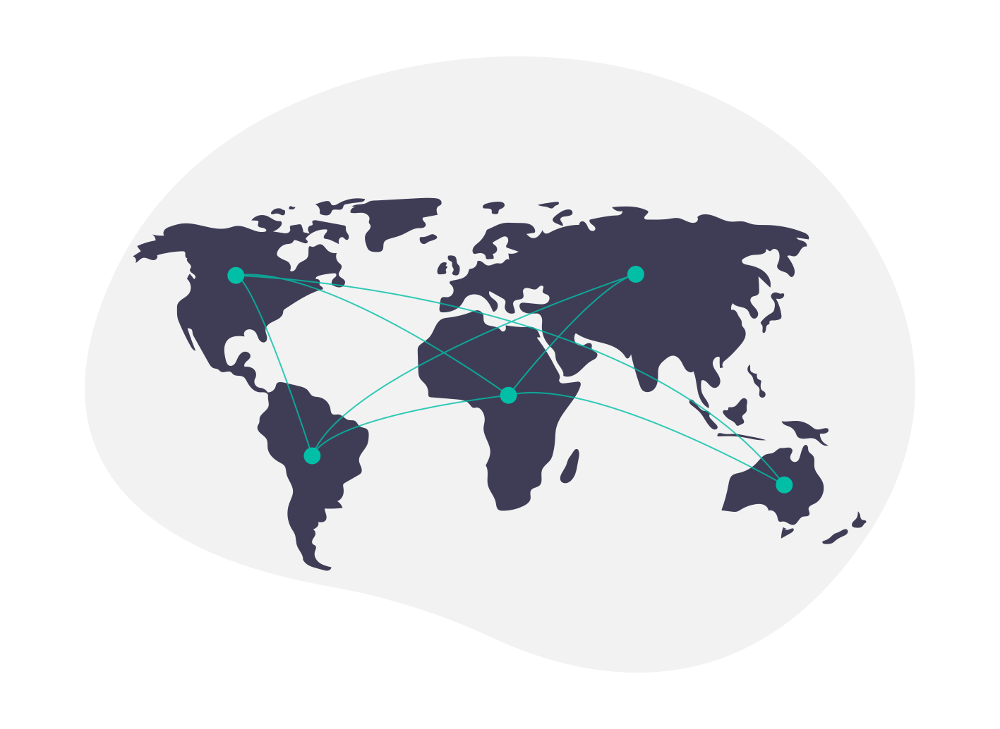
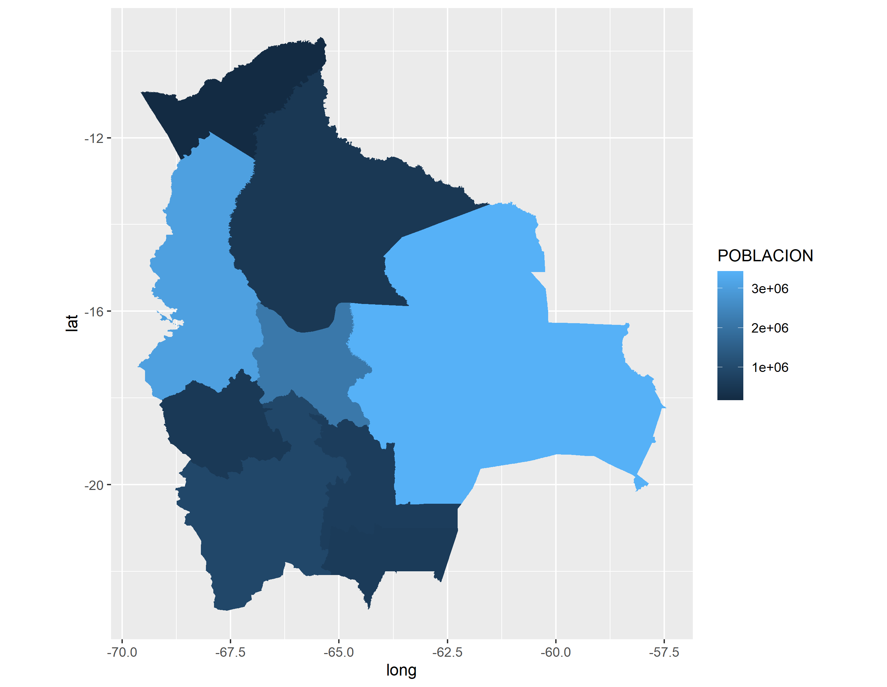
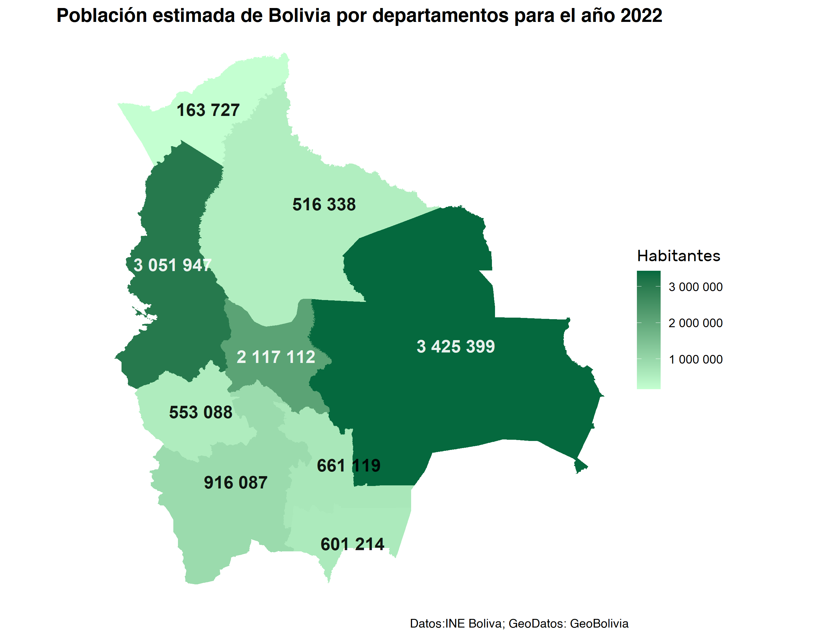
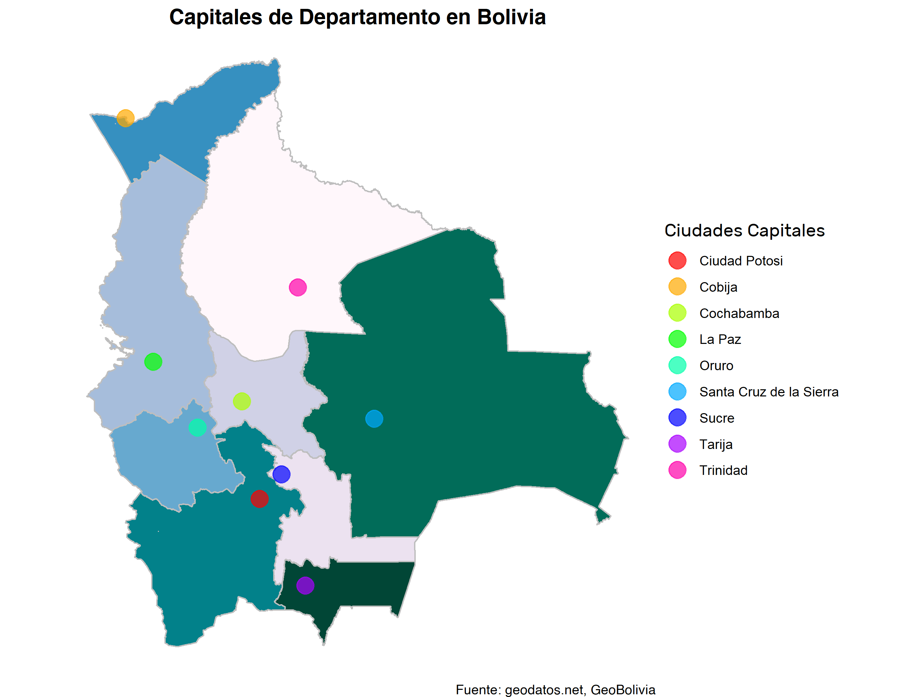

# Dibuja tus mapas en R usando archivos de formato Shapefile



Autor: [Ever Vino](https://github.com/EverVino)

Este breve tutorial te mostrará como graficar mapas en R, extaer datos de archivos de formato shapefile, resaltar puntos en tu mapa y modificar su apariencia utilizando las bibliotecas `rgdal` y `ggplot2`.

## Comenzando

Para que todas las bibliotecas funcionen correctamente se recomienda instalar o actualizar a las últimas versiones de [R](https://cran.r-project.org/) y de su IDE [RStudio](https://www.rstudio.com/) con su correspondiente complemento [RTools](https://cran.r-project.org/bin/windows/Rtools/rtools40.html).

En este artículo vamos a utilizar archivos de formato Shapefile. Si todavía no sabes de qué se trata, te explicamos a continuación.

Un archivo Shapefile contiene al menos:
* .shp - un archivo tipo shape, es la geometría misma.
* .shx - un archivo tipo index, tiene las posiciones indexadas del archivo .shp.
* .dbf - un archivo tipo attribute, tiene los atributos de cada forma en una columna, es de tipo dBase IV.

Adicionalmente, la carpeta donde se encuentran dichos archivos pueden contener otros archivos de formato .prj o .sbn, estos aportan más datos de la geometría o pueden ser usados en otros programas de sistemas de información geógrafica.

Los datos importados con `rgdal` a partir de un archivo shapefile, son objetos que contienen polígonos vectoriales con las coordenadas la latitud y la longitud en formato decimal. A partir de estos objetos, podemos extraer datos para graficarlos desde una tabla. La biblioteca `broom` nos ayuda en la extracción y logra agrupar los polígonos en diferentes grupos.

** Donde conseguir los archivos shapefile **
Muchos de estos archivos Shapefile representan mapas de nuestros Estados, por lo que están disponibles de manera gratuita en la mayoria de los casos, en otros son de paga o están más completos, actualizados y/o poseen datos específicos. Debajo mostramos algunas recursos web gratuitos que puedes usar.

[data.humdata.org](https://data.humdata.org/) para shapefiles varios países del mundo. (Algunos están desactualizados)

[geo.gob.bo](https://geo.gob.bo/geonetwork/srv/spa/catalog.search#/home) para shapefiles de Bolivia

### Instalación de pre-requisitos

Las siguientes bibliotecas de R son necesarias para realizar nuestro ejemplo.

```r
install.packages("ggplot2")    # biblioteca para graficar.
install.packages("rgdal")      # biblioteca para abrir archivo de formato shapefiles (datos geográficos)
install.packages("broom")      # biblioteca usada para extraer datos del archivo importado de shapefiles
install.packages("tidyverse")  # biblioteca usada para unir tablas
install.packages("rio")        # biblioteca para importar datos de archivos csv
install.packages("dplyr")     # biblioteca usada para agrupar por valores de columnas
install.packages("extrafont") # biblioteca para importar los tipos de letra de windows.
```
_(Recuerde que para ejecutar una linea de Comando en el Editor de RStudio se usa Ctrl+Enter)_

## Preparación de los datos para graficar

Nuestra base de datos fue descargada de [GeoBolivia](https://geo.gob.bo), [INE Bolivia](https://www.ine.gob.bo/) y [geodatos.net](https://www.geodatos.net/coordenadas/bolivia), una vez descargados estos datos fueron depurados para sólo tener los datos de nuestro interés.

Abrimos nuestras bibliotecas requeridas.

```r
library(ggplot2)
library(rgdal)
library(broom)
library(tidyverse)
library(rio)
library(dplyr)
library(extrafont)
```

Redireccionamos el directorio actual a nuestro directorio de trabajo e importamos nuestros archivos shapefiles.

```r
setwd("../mypath/") # Redirecciona el directo actual a nuestro directorio de trabajo
#Importamos los datos geofgráficos a nuestra varibales shapefile
shapefile = readOGR(
  dsn = ".",
  layer = "departamentos_geo",
  encoding = 'utf-8',
  use_iconv = TRUE
) 
```
- **`dsn`** directorio dentro de la carpeta donde se encuentran ficheros shapefiles, si se pone sólo un punto **"."** hace referencia a que los ficheros se encuentran en el directorio actual.

- **`encoding="utf-8", use_iconv=TRUE`** indica a la función `readOGR` que debe importarse con la codificación **utf-8**. Esto es necesario para el ejemplo, pues contiene caracteres especiales como **ñ** y vocales con tildes.

Para observar el contenido de `shapefile` use `View(shapefile)`.

Extrayendo datos en `geotable` para graficar y mostrando su cabecera.

```r
geotable = tidy(shapefile)
head(geotable)
```

```r
> head(geotable)
# A tibble: 6 x 7
   long   lat order hole  piece group id   
  <dbl> <dbl> <int> <lgl> <fct> <fct> <chr>
1 -65.8 -18.0     1 FALSE 1     0.1   0    
2 -65.8 -18.0     2 FALSE 1     0.1   0    
3 -65.8 -18.0     3 FALSE 1     0.1   0    
4 -65.8 -18.0     4 FALSE 1     0.1   0    
5 -65.8 -18.0     5 FALSE 1     0.1   0    
6 -65.8 -18.0     6 FALSE 1     0.1   0    
```

Notesé que geotable no poseé las etiquetas de los nombres de las regiones a graficar, esto lo arreglamos con:

```r
#Añadiendo una columna id para poder juntar las columnas de nuestro geotable con los datos correspondientes
shapefile$id <- row.names(shapefile)

#Añadiendo a geotable los datos que faltan desde shapefile y juntandolo por el id
geotable <- left_join(geotable,shapefile@data, by="id")
```

Para verificar que se han añadido los correspondientes nombres de regiones, use `head(geotable)`

Funciones auxiliares:

* **`shapefile$id <- `** crea una nueva columna **id** en shapefile o la reemplaza.
* **`row.names(shapefile) `** extrae los nombres de las filas del shapefile que por defecto es una numeración que va desde 0 y coincide con el **id** de nuestro `geotable`.
* **`shapefile@data `** accede a la tabla o dataframe **data** de nuestro shapefile.
* **`left_join(tabla1, tabla2, by = clave) `** junta dos tablas por izquierda, es decir añade valores que faltan de **tabla2** a la **tabla1** de acuerdo al código **clave** o columna común.

Ahora importamos nuestra tabla con los datos de población por departamento. (Haciendo `header = TRUE` nos aseguramos que la primera fila sean los nombres de las columnas):

```r
#Importando la tabla de datos de población
poblacion <- import("departamentospoblacion.csv", header = TRUE)
```
Notesé que cambiamos el nombre nuestra columna de en población `DEPARTAMENTO` por `DEPARTAMEN` para que coincidan nuestra columnas para luego poderlas juntarlas con `left_join()`.

```r
#Cambiando el nombre de la columna de DEPARTAMENTO POR DEPARTAMEN para poder juntar tablas segun nombre
#Dado que el nombre de los departamentos dentro del shapefile es DEPARTAMEN vemos conveniente cambiarlo a este.
colnames(poblacion)[colnames(poblacion) == "DEPARTAMENTO"] <- "DEPARTAMEN"
#Juntamos en datos ambas tablas
datos<-left_join(geotable, poblacion, by = "DEPARTAMEN")
```

## Mapa con ggplot2

Ahora, podemos graficar:

```r
ggplot() +
  geom_polygon(data = datos, aes(
    x = long,
    y = lat,
    group = group,
    fill = Poblacion2022
  )) +
  coord_equal() + labs(fill = "POBLACION")
```

* **`geom_polygon(data, aes(x, y, group, fill))`** dibuja polígonos con la tabla **data** y muestra la estética con **aes()**.
	**x**, **y** son los valores en ejes de las absisas y las ordenadas, estan agrupadas por el valor de la columna **group** y rellenadas con base a los valores de la columna **fill**.
* **`coord_equal()`** obliga a la gráfica que la relación de aspecto entre coordenadas sea 1:1.
* **`lab(fill)`** pone el título a la leyenda con **fill**.



## Mejorando la presentación de nuestro mapa

Entre las cosas que podemos hacer para mejorar la apariencia de nuestra gráfica están poner un título, cambiar los colores, el fondo, el formato de nuestra leyenda, en esta sección mostramos como hacer esos cambios.

Extraemos los valores de población y los ponemos como etiquetas dentro de nuestro mapa, para ello utilizamos las funciones `group_by()` y `sumamrise()` de la bilbioteca `dplyr`.

```r
etiquetas_poblacion <- datos %>% group_by(DEPARTAMEN) %>%
  summarise(
    label_long = mean(range(long)),
    label_lat = mean(range(lat)),
    pob = mean(Poblacion2022)
  )
```
¿Qué hicimos?

* **`tabla0 %>% funcion0 %>% funcion1 ...`** el símbolo **%>%** es conocido como **pipe operator** y sirve para concatenar valores de entrada y salida de diferentes funciones, es decir toma la **tabla0** como argumento de la **funcion0** y luego los resultados de la **funcion0** las utiliza como argumentos para **función1** y así sucesivamente.
* **`group_by(col) %>% summarise(col1=accion1, col2=accion2 ...)`** agrupa los datos en función del valor de columna **col** y con **summarise()** usa los datos agrupados para devolver nuevos valores **col1**, **col2** ... que pueden estar en función de los valores que están agrupados.
* **`range(v)`** Extrae los valores máximo y mínimo de un rango de datos **v**.
* **`mean(v)`** Devuelve el valor medio del vector **v**.

Si queremos incluir nuevas fuentes para el tipo de letra para nuestro mapa empleamos los siguientes comandos. 
(Nota: nos pedirá confirmación para realizar la importación de fuentes y tardará unos minutos):

```r
extrafont::font_import("C:/Windows/Fonts")
loadfonts(device = "win")
fonts() # Nos muestra las fuentes disponibles.
```

Incluimos los datos de `etiquetas_población` en nuestra gráfica

```r
ggplot() +
  geom_polygon(data = datos, aes(
    x = long,
    y = lat,
    group = group,
    fill = Poblacion2022
  )) +
  coord_equal() + theme_void() +
  geom_text(
    size = 4.5,
    alpha = 0.9,
    fontface = "bold",
    data = etiquetas_poblacion,
    mapping = aes(
      x = label_long,
      y = label_lat,
      label = format(pob, big.mark = " "),
      color = pob
    )
  ) +
  labs(title = "Población estimada de Bolivia por departamentos para el año 2022",
       fill = "Habitantes",
       caption = "Datos:INE Boliva; GeoDatos: GeoBolivia") +
  scale_colour_gradientn(colours = c("black", "black", "white", "white", "white"),
                         guide = "none") +
  scale_fill_continuous(
    low = "#C4FFD1",
    high = "#05693E",
    guide = "colorbar",
    labels = scales::label_number(big.mark = " ")
  ) +
  theme(
    plot.title = element_text(
      size = 14,
      face = "bold",
      family = "Helvetica",
      hjust = 0.5
    ),
    legend.title = element_text(size = 12, family = "Rubik"),
    plot.caption = element_text(family = "Helvetica")
  )
``` 

* **`theme_void()`** Elimina el fondo y los ejes de nuestra gráfica.
* **`geom_text(size, alpha, fontface, data, mapping = aes(x, y, label), color)`** dibuja texto extrayendo datos de la tabla **data**.
Muestra el texto **label** en las coordenadas **x** e **y**, para diferenciar los textos puede usarse **color**. 
Con **size**, **alpha** y **fontface** establecemos el tamaño, la opacidad y la estetica del texto respectivamente.
* **`format(v, big.mark)`** da el formato al valor **v** de separación de miles con **big.mark** (En nuestro ejemplo el separador de miles es sólo el espacio " ").
* **`labs(title, fill, caption)`** pone el texto de los títulos, con **title**, **fill**, **caption** pone el texto del título, la leyenda y el pie del gráfico respectivamente.
* **`scale_colour_gradientn(colours, guide)`** aplica una escala de colores a todos los valores asignados a el argumento **color** en nuestro ejemplo tenemos color dentro de la función  **geom_text(... aes(.. color = pob ...) ...)**, es decir los valores de **pob** estarán coloreados según los valores de **colours**. (la sintaxis `color` `colors` pueden intercambiarse sin problema con `colour` y `colours`), para que la guia de leyenda no se muestre usamos **guide = "none**.
* **`scale_fill_continuous(low, high, guide, labels)`** establece una escala de colores continua a los valores asignados a **fill** en nuestro ejemplo **fill** está dentro de la función **geom_polygon(... aes(... fill = Poblacion2022 ...) ...)**, es decir los valores de la columna **Poblacion2022** estaran afectados por esta función,
	**low** color correspondientes al valor más bajo, **high** color del valor más alto. Con **guide = colorbar** Mostramos nuestra leyenda en forma de colobar y **labels** modifica la apariencia en la escala de nuestro colorbar.
* **`scales::label_number(big.mark=" ")`** usa la función **label_number()**  de la biblioteca **scales**. 
Con esto modificamos la apariencia de los números de nuestra leyenda poniéndole un espacio **" "** como separador de miles.
(Notesé que podemos usar **scales::funcion()** en vez de **library(scales) funcion())**.
* **`theme(plot.title, legend.title, plot.caption)`** Modifica la apariencia del título, el título de la leyenda y el pie de gráfico respectivamente.
* **`element_text(size, face, family, hjust)`** Extrae propiedades del texto para modificar el tamaño, la estética, el tipo y la posición en horizontal.



## Añadiendo ubicaciones a nuestro mapa

Incluyendo las ubicaciones de ciudades capitales de departamento a nuestro mapa.

```r
ciudades = import("ciudades.csv") #Importamos la localización de las ciudades capitales

ggplot() +
  geom_polygon(
    data = datos,
    aes(
      x = long,
      y = lat,
      group = group,
      fill = DEPARTAMEN
    ),
    color = "gray",
    size = 0.5
  ) +
  geom_point(
    alpha = 0.7,
    data = ciudades,
    mapping = aes(x = lat, y = long, colour = Ciudad),
    size = 5
  ) +
  coord_equal() + labs(title = "Capitales de Departamento en Bolivia",
                       color = "Ciudades Capitales",
                       caption = "Fuente: geodatos.net, GeoBolivia") +
  scale_fill_brewer(palette = 'PuBuGn', guide = "none") +
  scale_color_manual(values = rainbow(9)) +
  theme_void() +
  theme(
    plot.title = element_text(
      size = 14,
      face = "bold",
      family = "Helvetica",
      hjust = 0.5
    ),
    legend.title = element_text(size = 12, family = "Rubik"),
    plot.caption = element_text(family = "Helvetica")
  ) 
```
* **`geom_point(alpha, data, mapping = aes(x, y, colour), size)`** Grafica puntos en el plot, comparte similares argumento que **geom_poligon()** y **geom_text()**.
* **`scale_fill_brewer(palette, guide)`** Similar a la función **scale_fill_continuous(low, high, guide, labels)**, aplica una escala de colores tipo brewer a todos los objetos asignados a **fill** con **pallete** seleccionamos el tipo de paleta de colores a aplicarse.
* **`scale_color_manual(values)`** Nos permite usar una escalr de colores manual, **values** debe ser un vector que contenga los valores de los colores de la escala.
* ***`raibow(9)`** Devuelve un vector con 9 colores del arcoiris.



#### Como asignar los colores

Puedes asignar los colores simplemente usando su nombre en inglés. Para el blanco es **white**, para el rojo, **red**. También puedes utilizar el código hexadecimal, como  **#FF4500** para el rojo anaranjado. Puedes agruparlos en una escala de colores, utilizando el comando `c("red","#FF4500"...)`. Una página recomendable para seleccionar colores y obtener su código de color con un click es [r-chart.com/colors/](https://r-charts.com/colors/).
También puede emplear las funciones auxiliares que ofrece `R`, por ejemplo: `scale_color`/`fill_brewer`/`viridis_`. Estas proporcionan escalas predefinidas que podrían mejorar el impacto visual.

## Como guardar nuestros mapas

RStudio ofrece la posibilidad de exportar fácilmente desde su menú, ubicado encima de la vista previa del gráfico "Export". Podemos optar por guardar nuestro mapa con mayor calidad o cierto formato y, para ello, podemos usar `ggsave()`, que nos permite exportar o guardar nuestro último gráfico ejecutado.

```r
ggsave(
  filename = "grafica3.png",
  path = ".../mypath/",
  scale = 1,
  device = "png",
  dpi = 320
)
```

Guarda el mapa con el nombre `filename` en la ruta `path`, con la escala y formato de `scale` y "device". Con `dpi` indicamos la cantidad de píxeles por pulgada, que es la calidad de nuestro archivo a exportar.

[Descarga lo archivos de este ejemplo](https://github.com/)


Bajo la Licencia (CC BY SA 4.0)

## Referencias

* [Instituto Nacional de Estadística Bolivia](https://www.ine.gob.bo) 
* [GeoBolivia](https://geo.gob.bo/)
* [geodatos.net](https://www.geodatos.net/coordenadas/bolivia)
* [Robinlovelace](https://github.com/Robinlovelace/Creating-maps-in-R)
* [Documentacion de R](https://www.rdocumentation.org)
